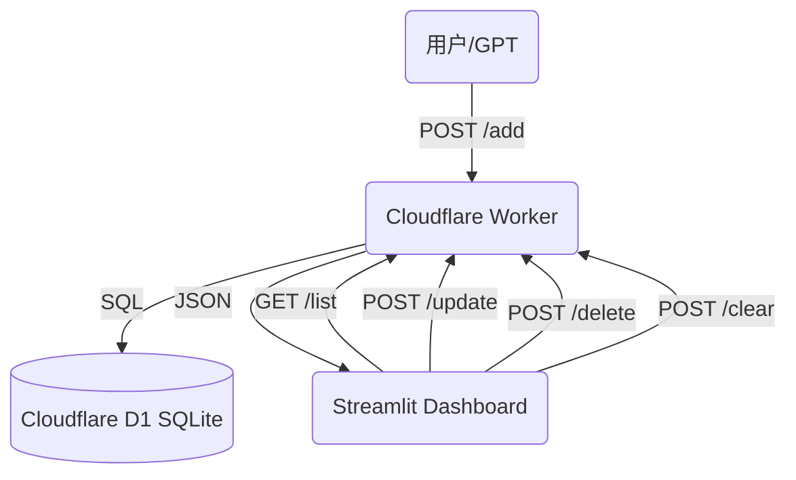

# GTPinput
GPT智能记录日常开支

这是一个由 GPT 驱动的个人记账与可视化系统，支持自然语言记账、自动分类、实时汇总，并通过 Streamlit 提供手机/电脑友好的可视化 Dashboard。

**最新架构 (v2.0)**：GPT (输入) → Cloudflare Worker (API) → D1 Database (SQLite) → Streamlit (可视化)

---

## 一、系统能力概览

- ✅ **自然语言 / 语音记账**：GPT 自动提取金额、分类、日期、备注。
- ✅ **API 驱动**：使用 Cloudflare Worker + D1，响应速度极快，无需 Google Sheets。
- ✅ **全功能仪表盘**：
    - **KPI 概览**：本月/今年支出、筛选合计、记录笔数。
    - **可视化图表**：月度趋势柱状图、分类占比饼图。
    - **交互式表格**：支持按月/分类筛选。
- ✅ **数据管理能力**：
    - **编辑**：直接在表格中修改金额、分类、日期等。
    - **删除**：支持勾选多条记录一键删除。
    - **清空**：提供“Danger Zone”一键清空所有数据功能。
- ✅ **移动端适配**：针对手机屏幕优化的 UI 布局和交互。

---

## 二、整体架构



---

## 三、API 接口 (Cloudflare Worker)

所有数据操作均通过 API 进行，确保前后端分离。需要传递 `X-API-Key` 进行鉴权。

| 方法 | 路径 | 描述 | 参数示例 |
|---|---|---|---|
| `POST` | `/add` | 新增记录 | `{"amount": 25, "item": "咖啡", "category": "餐饮"}` |
| `GET` | `/list` | 获取所有记录 | 无 |
| `POST` | `/update` | 更新记录 | `{"id": 12, "amount": 30, ...}` |
| `POST` | `/delete` | 删除记录 | `{"id": 12}` |
| `POST` | `/clear` | 清空所有数据 | 无 (需谨慎) |

---

## 四、Streamlit Dashboard 功能细节

1.  **KPI 卡片**
    - `📅 本月支出`：实时计算当月总支出。
    - `🗓️ 今年支出`：累计年度总支出。
    - `🔍 当前筛选合计`：随侧边栏筛选条件动态变化。
    
2.  **图表分析**
    - **月度趋势 (柱状图)**：直观展示每月消费高低，柱条上方显示具体金额。
    - **分类占比 (饼图)**：清晰展示钱花哪儿了。

3.  **最近记录管理 (Edit & Delete)**
    - **修改**：直接点击表格单元格进行编辑，点击“保存修改”生效。
    - **删除**：勾选表格左侧的 `🗑️` 复选框，按钮变为红色确认状态，点击即可删除。

4.  **危险操作区 (Danger Zone)**
    - 位于页面最底部，需勾选确认框后才能点击“💣 立即清空所有数据”。

---

## 五、部署与配置

### 1. Cloudflare Worker
- 代码位于 `worker/index.js`。
- 使用 `wrangler deploy` 部署。
- 绑定 D1 数据库 `expense_db`。

### 2. Streamlit App
- 代码位于 `app.py`。
- 本地运行：`streamlit run app.py`
- 配置文件 `.streamlit/secrets.toml`：
    ```toml
    [general]
    API_URL = "https://your-worker.workers.dev"
    API_KEY = "your-secret-key"
    ```

---

## 六、未来计划
- [ ] 预算设置与超支提醒
- [ ] 多账户/多用户支持
- [ ] 导出 CSV/Excel 功能
