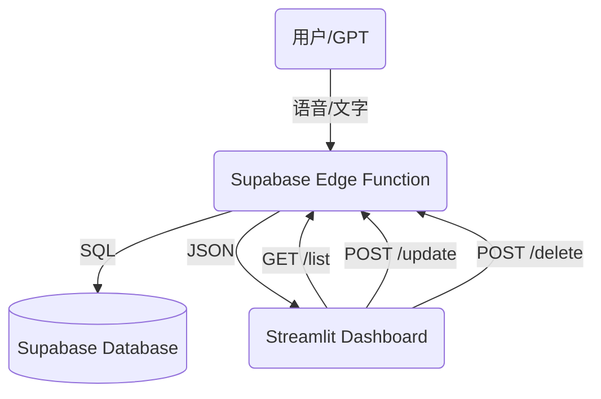

# GTPinput 💰
**GPT 智能记账系统**

这是一个由 GPT 驱动的个人记账全栈系统，支持自然语言记账、自动分类、实时汇总、自动周期扣款、月度预算管理，并通过 Streamlit 提供手机/电脑友好的可视化 Dashboard。

**系统特性**：
- **记账**: Streamlit Chat UI (输入) → OpenAI (解析) → Cloudflare Worker (API) → D1 Database
- **文档**: Streamlit File Uploader → OpenAI (识图) → Google Drive/Sheets/Calendar (归档)

---

## 🚀 进化历程 (Evolution Timeline)

### v3.8 动态全球化 (Dynamic Globalization) [Latest]
- **动态语言检测**: 系统现在会自动扫描 `locales/` 目录。只需添加 `.json` 文件并设置 `_lang_display_name`，即可在界面中自动显示新语言，无需修改代码。
- **五国语言包**: 补齐了 **日语 (ja)**、**西班牙语 (es)** 和 **法语 (fr)** 的全量翻译，实现了中、英、日、西、法五路并行。
- **分类名同步翻译**: 预算管理与订阅管理中的分类下拉菜单（餐饮、交通等）现在会根据系统语言自动切换显示。

### v3.7 全球化与极简主义 (Localization & Minimalism)
- **100% 国际化支持 (i18n)**：全新的 `locales/` 架构，支持中英文一键无缝切换。从侧边栏、表单标签到 AI 的回复，实现了真正的全站闭环翻译。
- **CSS 深度破解 (UI Cleanup)**：通过 CSS 注入技术破解了 Streamlit 默认的文件上传组件，成功汉化了写死的 “Drag and drop” 和 “Browse files” 标签。
- **极简画质图表**：清除了折线图和柱状图多余的轴标题及 Hover Popup 中的冗余前缀。
- **侧边栏重构**：优化了头像与标题的排列，移除冗余静态标题，改用动态翻译标题。

### v3.6 移动端深度优化与 SaaS 架构
- **全局多货币体系**：支持调整全局主货币（CNY, USD, EUR 等），全站看板即刻转换货币符号。
- **AI 智能汇率引擎**：聊天助手能基于实时汇率进行跨币种转换估算。
- **全新底部导航**：引入原生 App 风格的 3 按钮悬浮导航栏，最大化节省屏幕空间。
- **纯净沉浸式体验**：全局隐去 Streamlit 默认菜单、Hamburger 和 Footer。
- **移动端专属设置中心**：文件夹图标(`📁`)渐变色按钮，提升触控体验。

### v3.5 极致 UI 与 稳定性
- **综合卡片 V3 (Unified KPI Card)**：采用毛玻璃设计 (`backdrop-filter`)、文字渐变和金融级排版。
- **渲染引擎修复**：彻底解决 HTML 缩进导致的 Markdown 解析错误。
- **自适应布局**：手机端间距动态微调，桌面与手机端逻辑独立渲染。

### v3.4 视觉重构 (Visual Overhaul)
- **卡片重构**：顶部职业深蓝 (Professional Dark Blue) + 底部暗黑时间轴设计。
- **智能进度条**：40px 圆角设计，配合 **🔵健康 / 🟠预警 / 🔴超支** 动态预警颜色。
- **Today 指针**：实时显示当前日期在月度时间轴上的位置。
- **每日建议**：自动计算剩余天数的建议日均消费额。

### v3.3 GPT 深度集成 (Advanced Actions)
- **不仅是记录**：赋予 GPT **删除**和**修改**记录的权限。
- **自然语言操作**：支持 "把昨天那笔删了"、"改成2600"、"查一下上周花了多少"。
- **智能备注系统**：自动标识来源：💬 App 助手、🤖 外部 GPT、🔄 自动订阅。

### v3.2 响应式与体验升级
- **响应式布局 (Responsive)**：页面自动适应宽屏和手机屏幕。
- **增强订阅管理**：新增 **Weekly (每周)** 周期支持，引入日历选择器 (Date Picker)。
- **便捷删除**：管理页面新增独立 **删除 (Delete)** 勾选框。

### v3.1 性能与交互优化
- **🔐 保持登录 (Persistent Login)**: 支持 "Remember Me" 选项，自动缓存会话。
- **🔄 手动刷新 (Manual Refresh)**: 仪表盘新增刷新按钮。
- **交互优化**: 全新 "Thinking..." 思考动画，登录界面支持回车键。

### v3.0 核心功能基石
- **月度预算管理**：自动轮转、可视化进度条、Emoji 图标阵列。
- **自动周期扣款**：支持房租、订阅等固定支出自动化记录，基于 Cloudflare Cron 触发。
- **基础 Dashboard**：KPI 概览、折线趋势图、分类占比饼图。
- **智能文档归档**：集成 SmartDoc 引擎，支持收据识图与 Google Drive 同步。


---

## 🏗️ 整体架构



---

## 🛠️ API 接口 (Supabase Edge Function)

所有操作均需通过 Supabase Functions 调用。Custom GPT无需鉴权（已配置 `--no-verify-jwt`）。

### 核心记账
| 方法 | 路径 | 描述 |
|---|---|---|
| `POST` | `/add` | 自然语言记账 (GPT 解析) |
| `GET` | `/list` | 获取最近记录 |
| `POST` | `/update` | **[NEW]** 修改记录 (ID) |
| `POST` | `/delete` | **[NEW]** 删除记录 (ID) |

### 预算与周期
| 方法 | 路径 | 描述 |
|---|---|---|
| `GET` | `/budget/list` | 获取预算列表 |
| `POST` | `/budget/add` | 新增预算 |
| `POST` | `/budget/delete` | 删除预算 |
| `GET` | `/recurring/list` | 获取固定规则列表 |
| `POST` | `/recurring/add` | 新增规则 |
| `POST` | `/recurring/delete` | 删除规则 |

---

## 📂 文件结构 (File Structure)

```text
├── .streamlit/          # Streamlit 配置 (secrets.toml)
├── assets/              # 静态资源 (Logo, Icons)
├── config/              # 配置文件 (rules.py)
├── docs/                # 项目文档
├── modules/             # Python 模块 (UI, Services, Auth)
│   ├── auth.py          # 认证逻辑
│   ├── services.py      # 数据库交互
│   └── ui_v2.py         # 核心 UI 组件 & Mobile 适配
├── scripts/             # 自动化脚本 (Cron Jobs)
├── supabase/            # Supabase 相关
│   ├── functions/
│   │   └── gpt-api/     # 核心 API (Deno/Typescript)
│   └── config.toml      # Supabase 配置
├── app.py               # Streamlit 主程序 (Frontend)
├── expense_chat.py      # 本地对话逻辑处理
├── openapi_supabase.json # Custom GPT Action Schema
├── requirements.txt     # Python 依赖
└── supabase_setup.sql   # 数据库初始化脚本
```

---

## 🖥️ 部署指南

### 1. Supabase Edge Function (后端 API)
这是连接 Custom GPT 和数据库的核心桥梁。

**前提条件**:
- 安装 Supabase CLI / Node.js
- 登录: `npx supabase login`

**部署命令**:
```bash
npx supabase functions deploy gpt-api --no-verify-jwt
```
> 注意: `--no-verify-jwt` 是必须的，因为 Custom GPT 不会发送 Supabase 的 Auth Token。我们通过代码中的逻辑自动关联活跃用户。

### 2. Custom GPT 配置
1. 创建一个新的 GPT。
2. 在 **Actions** 中，导入 `openapi_supabase.json` 的内容。
3. **Authentication**: 选择 `None` (无需鉴权)。
4. Enjoy! 🎉

### 3. Streamlit Dashboard (前端 App)
本地运行:
```bash
pip install -r requirements.txt
streamlit run app.py
```

配置文件 `.streamlit/secrets.toml`:
```toml
[supabase]
url = "YOUR_SUPABASE_URL"
key = "YOUR_SUPABASE_ANON_KEY"
```

---

## 💡 OpenAI API 成本预估 (Cost Estimation)

本项目核心依托 OpenAI 的 **`gpt-4o-mini`** 进行自然语言解析，这是一个极具性价比的旗舰级小模型。由于我们设计了**降级兜底策略**，您可以把应用发给没有 API Key 的朋友开箱即用（使用的是您配置的全局 Key），成本完全可控：

- **单人低频使用（例如：每天记账 5 次）**
  每次发送约 1000 Tokens (含历史账单上下文)，接收约 100 Tokens。
  - 每天成本 $\approx$ $0.00126
  - **全年成本 $\approx$ $0.46 (低于 1 美元 / 约 7 元人民币)**

- **家庭重度使用（例如：一家三口，每天查询+记账 30 次）**
  - 每天成本 $\approx$ $0.0081
  - **全年成本 $\approx$ $2.95 (约 21 元人民币)**

_注：基于 2024-2026 年 OpenAI 官方定价（Input: $0.15/1M, Output: $0.60/1M）。朋友重度使用时，也可要求其在「设置」中填入自己的 API Key。_

---

## 📝 待办计划 (Roadmap)
- [x] **V3.0**: 月度预算管理 (Monthly Budgets)
- [x] **V3.0**: 自动周期扣款 (Recurring Expenses)
- [x] **V3.3**: GPT 深度集成 (增删改查全支持)
- [x] **Fix**: 多设备/多账号数据同步问题
- [ ] 多账户/多币种支持
- [ ] 年度消费深度分析报告
