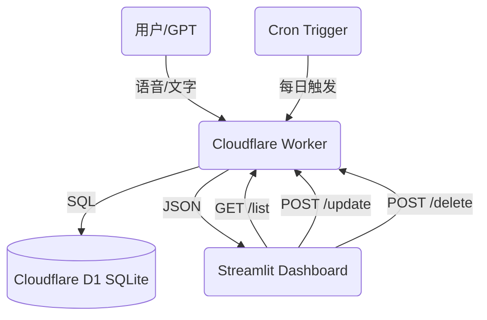

# GTPinput 💰
**GPT 智能记账系统 V3.0**

这是一个由 GPT 驱动的个人记账全栈系统，支持自然语言记账、自动分类、实时汇总、自动周期扣款、月度预算管理，并通过 Streamlit 提供手机/电脑友好的可视化 Dashboard。

**最新架构 (v3.0)**：
- **记账**: Streamlit Chat UI (输入) → OpenAI (解析) → Cloudflare Worker (API) → D1 Database
- **文档**: Streamlit File Uploader → OpenAI (识图) → Google Drive/Sheets/Calendar (归档)

---

## ✨ V3.0 新特性

### 1. 📅 月度预算管理 (Monthly Budgets)
- **自动轮转**：预算进度按月自动重置。
- **可视化进度条**：自定义 CSS 实现的高颜值进度条，支持明亮/暗黑双模式。
- **图标阵列**：10x4 交互式 Emoji 选择面板，让每个分类都个性十足。

### 2. 🔄 自动周期扣款 (Recurring Expenses)
- **固定开销自动化**：支持“房租”、“订阅费”等固定支出的自动记录。
- **Cron 触发**：基于 Cloudflare Cron Triggers，每天自动检查并生成账单。
- **灵活配置**：支持按周、按月、按年设置规则（如“每月 1 日”、“每周五”）。

### 3. 🤖 GPT 能力升级 (Custom GPT Actions)
- **不仅是记录**：现在赋予了 GPT **删除**和**修改**记录的权限。
- **自然语言操作**：
    - "把昨天那笔打车费删了"
    - "房租金额改成 2600"
    - "查一下上周吃饭花了多少"

### 4. ✅ 智能交互助手 (New)
- **记账**: "午饭 30"
- **查询**: "上个月花了多少？", "查一下买水果的记录"
- **删除**: "删除上一条", "删除买烟的记录"

### 5. ✅ 智能文档归档 (New)
- **集成 SmartDoc 核心引擎**：上传发票/证件照片，自动识别并上传至 Google Drive，写入 Google Sheets 和 Calendar。

### 6. ✅ 收据自动记账 (New)
- **自动提取**：上传收据图片时，自动提取金额并记入账本。

### 7. ✅ 核心系统升级
- **API 驱动**：使用 Cloudflare Worker + D1，响应速度极快。
- **全功能仪表盘**：
    - **KPI 概览**：本月/今年支出、筛选合计、记录笔数。
    - **可视化图表**：月度趋势柱状图、分类占比饼图。
    - **交互式表格**：支持按月/分类筛选。
- **📸 移动端相机支持 (New)**：
    - 集成网页版相机，支持手机端直接拍照上传。
    - 自动判断文件来源（相册/相机）进行智能分类。
- **🎨 专业级 UI 设计 (New)**：
    - **Deep Blue Theme**：深蓝极客风格界面，护眼且专业。
    - **智能交互设计**：左侧对齐的沉浸式对话体验。
    - **动态头像**：集成 Dicebear 高清矢量头像 (机器人 🤖 vs 用户 🧑)。
- **数据管理能力**：
    - **编辑**：直接在表格中修改金额、分类、日期等。
    - **删除**：支持勾选多条记录一键删除。
    - **清空**：提供“Danger Zone”一键清空所有数据功能。

### 8. 🚀 V3.1 体验升级 (Updates)
- **🔐 保持登录 (Persistent Login)**: 支持 "Remember Me" 选项，自动缓存会话，免去重复登录烦恼。
- **🔄 手动刷新 (Manual Refresh)**: 仪表盘新增刷新按钮，一键同步最新数据。
- **✨ 交互优化**:
    - 全新 "Thinking..." 思考动画 (光环特效)。
    - 登录界面支持回车键提交。
    - 记录列表按 "日期 + 录入顺序" 智能排序。

    - 记录列表按 "日期 + 录入顺序" 智能排序。

### 9. 📝 智能备注系统 (New)
系统通过专属图标自动标识记录来源，一目了然：
- 💬 **App 助手**：网页/手机端直接对话录入（如 `💬 午饭 20`）。
- 🤖 **定制 GPT**：通过外部 GPTs / API 调用录入（如 `🤖 外部GPT记录`）。
- 🔄 **自动订阅**：系统自动扣款生成的记录（如 `🔄 自动订阅`）。

### 10. 🚀 V3.2 最新更新 (Latest)
- **📱 响应式布局 (Responsive Layout)**: 页面现在自动适应宽屏显示器和手机屏幕，视觉体验更佳。
- **🔄 增强的订阅管理**:
    - 新增 **Weekly (每周)** 扣款周期支持。
    - 更加直观的日期选择器 (Calendar Date Picker)。
    - 智能显示下次扣款规则 (如 "每周五" 或 "每月25日")。
- **🗑️ 便捷删除功能**:
    - 在“预算管理”和“订阅管理”中新增了独立的 **删除 (Delete)** 勾选框。
    - 勾选后保存即可删除，操作更安全、直观。

---

## 🏗️ 整体架构



---

## 🛠️ API 接口 (Cloudflare Worker)

所有操作均需 `X-API-Key` 鉴权。

### 核心记账
| 方法 | 路径 | 描述 |
|---|---|---|
| `POST` | `/add` | 自然语言记账 (GPT 解析) |
| `GET` | `/list` | 获取最近记录 |
| `POST` | `/update` | **[NEW]** 修改记录 (ID) |
| `POST` | `/delete` | **[NEW]** 删除记录 (ID) |

### 预算与周期
| 方法 | 路径 | 描述 |
|---|---|---|
| `GET` | `/budget/list` | 获取预算列表 |
| `POST` | `/budget/add` | 新增预算 |
| `POST` | `/budget/delete` | 删除预算 |
| `GET` | `/recurring/list` | 获取固定规则列表 |
| `POST` | `/recurring/add` | 新增规则 |
| `GET` | `/recurring/check` | 手动触发规则检查 |

---

## 📂 文件结构 (File Structure)

```text
.
├── .streamlit/          # Streamlit 配置 (secrets.toml, config.toml)
├── config/              # 配置文件 (rules.py, settings.json)
├── docs/                # 项目文档 (tasks, plans)
├── supabase/            # Supabase 相关 (Edge Functions)
│   └── functions/
│       └── gpt-api/     # 核心 API (Cloudflare Worker/Supabase Edge Function)
├── scripts/             # 自动化脚本
│   └── cron_job.py      # 固定支出检查脚本 (GitHub Action)
├── .github/workflows/   # GitHub Actions 配置
│   └── daily_check.yml  # 定时任务工作流
├── app.py               # Streamlit 主程序 (Frontend)
├── expense_chat.py      # 本地对话逻辑处理
├── openapi_supabase.json # OpenAI Actions 定义
├── requirements.txt     # Python 依赖
└── supabase_setup.sql   # 数据库初始化脚本
```

---

## 🖥️ 部署指南

### 1. Supabase / Cloudflare Worker (后端)
需要绑定 D1 数据库 (`expense_db`) 和设置 `APP_API_KEY` / `OPENAPI_API_KEY` 环境变量。

**关键配置 (wrangler.toml / supabase/config.toml)**:
```toml
[[d1_databases]]
binding = "expense_db"
database_name = "expense-db"
database_id = "your-id"

[triggers]
crons = ["0 0 * * *"] # 每天午夜触发

### 2. GitHub Actions (自动扣款)
项目包含 `Daily Recurring Check` 工作流，每天自动检查固定支出。
**配置要求**: 在 GitHub Repository Secrets 中添加:
- `SUPABASE_URL`: 你的 Supabase URL
- `SUPABASE_KEY`: 你的 Supabase **Service Role** Key (这是必要的，因为自动化脚本需要绕过 RLS 检查所有用户的规则)
```

### 2. Streamlit Dashboard (前端)
本地运行或部署到 Streamlit Cloud。

```bash
pip install -r requirements.txt
streamlit run app.py
```

配置文件 `.streamlit/secrets.toml`:
```toml
[supabase]
url = "YOUR_SUPABASE_URL"
key = "YOUR_SUPABASE_ANON_KEY"

[general]
API_URL = "https://your-worker.workers.dev" # (可选: 如果使用独立 Worker)
API_KEY = "your-key"
```

---

## 📝 待办计划 (Roadmap)
- [x] **V3.0**: 月度预算管理 (Monthly Budgets)
- [x] **V3.0**: 自动周期扣款 (Recurring Expenses)
- [ ] 多账户/多币种支持
- [x] 导出 Excel/CSV 报表 (已支持 CSV 导出)
- [ ] 年度消费深度分析报告
