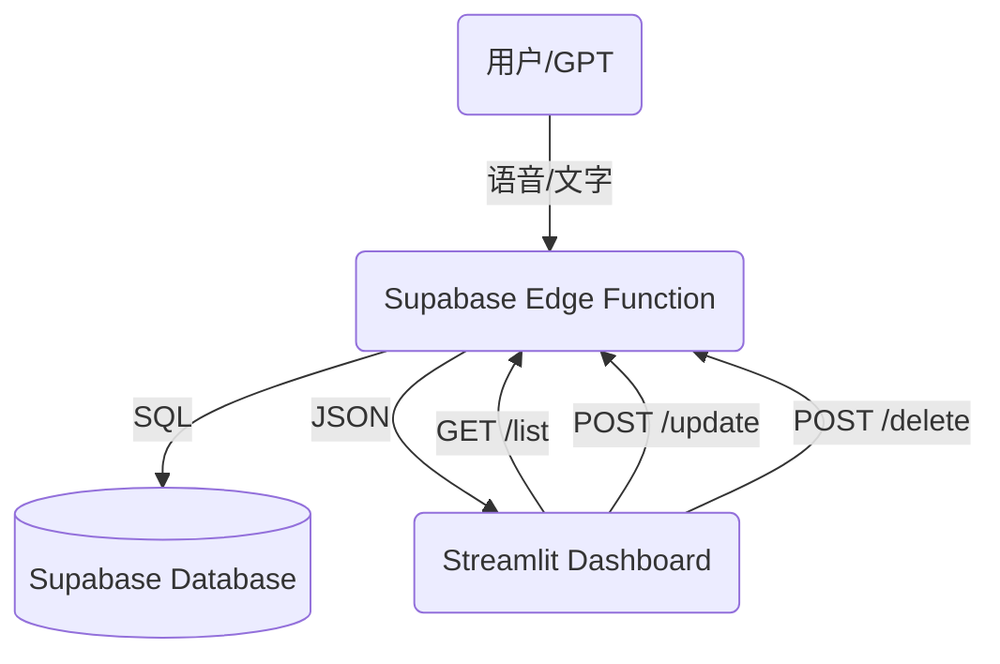

# GTPinput 💰
**GPT 智能记账系统 V3.4**

这是一个由 GPT 驱动的个人记账全栈系统，支持自然语言记账、自动分类、实时汇总、自动周期扣款、月度预算管理，并通过 Streamlit 提供手机/电脑友好的可视化 Dashboard。

**最新架构 (v3.0)**：
- **记账**: Streamlit Chat UI (输入) → OpenAI (解析) → Cloudflare Worker (API) → D1 Database
- **文档**: Streamlit File Uploader → OpenAI (识图) → Google Drive/Sheets/Calendar (归档)

---

## ✨ V3.6 核心特性 (Latest)
### 🌍 全局多货币体系 & AI 汇率系统 (Multi-Currency & AI Exchange)
- **开箱即用 (SaaS-Ready)**：新用户只需邮箱注册激活即可使用，系统默认提供公共 AI Token 兜底，用户也可在个人设置中绑定私有 API Key。
- **动态货币切换**：在“⚙️ 设置”中一键调整全局主货币（支持 CNY, USD, EUR, GBP, JPY, THB 等），全站看板、热力图、表格数据即刻无缝转换货币符号。
- **AI 智能汇率引擎**：聊天记账助手会始终遵从您的专属货币进行反馈。当遇到跨国消费查询（如 *"这笔泰铢相当于多少美元"*）时，AI 能基于自有知识库为您进行实时的汇率估算换算。

---

## ✨ 历代特性 (Core Features)

### 1. 📅 月度预算管理 (Monthly Budgets)
- **自动轮转**：预算进度按月自动重置。
- **可视化进度条**：自定义 CSS 实现的高颜值进度条，支持明亮/暗黑双模式。
- **图标阵列**：10x4 交互式 Emoji 选择面板，让每个分类都个性十足。

### 2. 🔄 自动周期扣款 (Recurring Expenses)
- **固定开销自动化**：支持“房租”、“订阅费”等固定支出的自动记录。
- **Cron 触发**：基于 Cloudflare Cron Triggers，每天自动检查并生成账单。
- **灵活配置**：支持按周、按月、按年设置规则（如“每月 1 日”、“每周五”）。

### 3. 🤖 GPT 能力升级 (Custom GPT Actions)
- **不仅是记录**：现在赋予了 GPT **删除**和**修改**记录的权限。
- **自然语言操作**：
    - "把昨天那笔打车费删了"
    - "房租金额改成 2600"
    - "查一下上周吃饭花了多少"

### 4. ✅ 智能交互助手 (New)
- **记账**: "午饭 30"
- **查询**: "上个月花了多少？", "查一下买水果的记录"
- **删除**: "删除上一条", "删除买烟的记录"

### 5. ✅ 智能文档归档 (New)
- **集成 SmartDoc 核心引擎**：上传发票/证件照片，自动识别并上传至 Google Drive，写入 Google Sheets 和 Calendar。

### 6. ✅ 收据自动记账 (New)
- **自动提取**：上传收据图片时，自动提取金额并记入账本。

### 7. ✅ 核心系统升级
- **API 驱动**：使用 Cloudflare Worker + D1，响应速度极快。
- **全功能仪表盘**：
    - **KPI 概览**：本月/今年支出、筛选合计、记录笔数。
    - **可视化图表**：月度趋势柱状图、分类占比饼图。
    - **交互式表格**：支持按月/分类筛选。
- **📸 移动端相机支持 (New)**：
    - 集成网页版相机，支持手机端直接拍照上传。
    - 自动判断文件来源（相册/相机）进行智能分类。
- **🎨 专业级 UI 设计 (New)**：
    - **Deep Blue Theme**：深蓝极客风格界面，护眼且专业。
    - **智能交互设计**：左侧对齐的沉浸式对话体验。
    - **动态头像**：集成 Dicebear 高清矢量头像 (机器人 🤖 vs 用户 🧑)。
- **数据管理能力**：
    - **编辑**：直接在表格中修改金额、分类、日期等。
    - **删除**：支持勾选多条记录一键删除。
    - **清空**：提供“Danger Zone”一键清空所有数据功能。

### 8. 🚀 V3.1 体验升级 (Updates)
- **🔐 保持登录 (Persistent Login)**: 支持 "Remember Me" 选项，自动缓存会话，免去重复登录烦恼。
- **🔄 手动刷新 (Manual Refresh)**: 仪表盘新增刷新按钮，一键同步最新数据。
- **✨ 交互优化**:
    - 全新 "Thinking..." 思考动画 (光环特效)。
    - 登录界面支持回车键提交。
    - 记录列表按 "日期 + 录入顺序" 智能排序。

    - 记录列表按 "日期 + 录入顺序" 智能排序。

### 9. 📝 智能备注系统 (New)
系统通过专属图标自动标识记录来源，一目了然：
- 💬 **App 助手**：网页/手机端直接对话录入（如 `💬 午饭 20`）。
- 🤖 **定制 GPT**：通过外部 GPTs / API 调用录入（如 `🤖 外部GPT记录`）。
- 🔄 **自动订阅**：系统自动扣款生成的记录（如 `🔄 自动订阅`）。

### 10. 🚀 V3.2 最新更新 (Latest)
- **📱 响应式布局 (Responsive Layout)**: 页面现在自动适应宽屏显示器和手机屏幕，视觉体验更佳。
- **🔄 增强的订阅管理**:
    - 新增 **Weekly (每周)** 扣款周期支持。
    - 更加直观的日期选择器 (Calendar Date Picker)。
    - 智能显示下次扣款规则 (如 "每周五" 或 "每月25日")。
- **🗑️ 便捷删除功能**:
    - 在“预算管理”和“订阅管理”中新增了独立的 **删除 (Delete)** 勾选框。
    - 勾选后保存即可删除，操作更安全、直观。

### 10. 🚀 V3.3 视觉重构 (Visual Overhaul)
- **💳 预算卡片重构 (Budget Cards Redesign)**:
    - **双色卡片设计**: 顶部职业深蓝 (Professional Dark Blue) + 底部暗黑时间轴。
    - **智能进度条**: 
        - 粗壮进度条 (40px) 配合圆角设计。
        - **颜色动态预警**: 🔵健康 / 🟠预警 / 🔴超支。
        - **Today 指针**: 实时显示当前日期在月度时间轴上的位置。
    - **每日建议**: 自动计算剩余天数的建议日均消费额。
- **📊 视觉一致性**:
    - 全局统一的 KPI 标题样式 (Bold + Icon)。
    - 热力图 (Heatmap) 高度严格对齐，视觉更整洁。

### 11. 🎨 V3.5 极致 UI 与 稳定性 (Professional Refinement)
- **综合卡片 V3 (Unified KPI Card)**:
    *   **Hero 视图**: 采用超大加粗字体与文字渐变效果，视觉重心更明确。
    *   **毛玻璃设计**: 半透明卡片叠加 (`backdrop-filter`)，提升了界面的现代感与层次感。
    *   **金融级排版**: 优化了标签字体间距与图标比例，模拟专业金融 App 的细腻质感。
- **渲染引擎修复**:
    *   **零缩进策略**: 彻底解决了因 HTML 缩进导致的 Markdown 解析错误（防止代码块露出）。
    *   **自适应布局**: 手机端间距根据视觉比例动态微调，确保平衡美观。
    *   **跨端隔离**: 桌面与手机端逻辑独立渲染，互不干扰。

### 12. 📱 V3.6 移动端深度优化 (Mobile Enhancements)
- **全新底部导航:** 引入了类似于原生 App 的 3 按钮底部悬浮导航栏 (首页/AI助手/设置)，去除了拥挤的文字标签，使图标居中并带有发光激活态，最大化节省屏幕垂直空间。
- **纯净沉浸式体验:** 全局隐去了 Streamlit 默认的右上角 "Manage App" 控件、Hamburger 菜单以及底部 Footer，带来100%全屏应用体验。
- **移动端专属设置中心:**
    *   针对手机端完全隐藏了 API Key 设置项，保护页面空间。
    *   将上传头像、本地货币选项等重新进行排版与靠左对齐。
    *   将默认的文件上传组件深度定制为**文件夹图标(`📁`)渐变色按钮**，极大提升了触控体验和视觉高级感。
    *   采用胶囊状深色卡片包裹用户信息，配合醒目的红色“注销”按钮，操作更加直观安全。

### 13. 🌍 V3.7 全球化与极简主义 (Localization & Minimalism) [Latest]
- **100% 国际化支持 (i18n)**：全新的 `locales/` 架构，支持中英文一键无缝切换。从侧边栏、表单标签到 AI 的回复，实现了真正的全站闭环翻译。
- **CSS 深度破解 (UI Cleanup)**：
    *   通过 CSS 注入技术破解了 Streamlit 默认的文件上传组件，成功汉化了写死的 “Drag and drop” 和 “Browse files” 标签。
- **极简画质图表**：
    *   **轴标题净化**：清除了折线图和柱状图多余的“有效金额”、“日期”等轴标题，让视觉焦聚于波动本身。
    *   **浮窗纯净化**：移除了所有图表 Hover Popup 中的冗余前缀，仅显示核心数据。
- **侧边栏重构**：优化了头像与标题的排练逻辑，移除了冗余的静态中文标题，改用动态翻译，视觉上更加高级且平衡。

---

## 🏗️ 整体架构



---

## 🛠️ API 接口 (Supabase Edge Function)

所有操作均需通过 Supabase Functions 调用。Custom GPT无需鉴权（已配置 `--no-verify-jwt`）。

### 核心记账
| 方法 | 路径 | 描述 |
|---|---|---|
| `POST` | `/add` | 自然语言记账 (GPT 解析) |
| `GET` | `/list` | 获取最近记录 |
| `POST` | `/update` | **[NEW]** 修改记录 (ID) |
| `POST` | `/delete` | **[NEW]** 删除记录 (ID) |

### 预算与周期
| 方法 | 路径 | 描述 |
|---|---|---|
| `GET` | `/budget/list` | 获取预算列表 |
| `POST` | `/budget/add` | 新增预算 |
| `POST` | `/budget/delete` | 删除预算 |
| `GET` | `/recurring/list` | 获取固定规则列表 |
| `POST` | `/recurring/add` | 新增规则 |
| `POST` | `/recurring/delete` | 删除规则 |

---

## 📂 文件结构 (File Structure)

```text
├── .streamlit/          # Streamlit 配置 (secrets.toml)
├── assets/              # 静态资源 (Logo, Icons)
├── config/              # 配置文件 (rules.py)
├── docs/                # 项目文档
├── modules/             # Python 模块 (UI, Services, Auth)
│   ├── auth.py          # 认证逻辑
│   ├── services.py      # 数据库交互
│   └── ui_v2.py         # 核心 UI 组件 & Mobile 适配
├── scripts/             # 自动化脚本 (Cron Jobs)
├── supabase/            # Supabase 相关
│   ├── functions/
│   │   └── gpt-api/     # 核心 API (Deno/Typescript)
│   └── config.toml      # Supabase 配置
├── app.py               # Streamlit 主程序 (Frontend)
├── expense_chat.py      # 本地对话逻辑处理
├── openapi_supabase.json # Custom GPT Action Schema
├── requirements.txt     # Python 依赖
└── supabase_setup.sql   # 数据库初始化脚本
```

---

## 🖥️ 部署指南

### 1. Supabase Edge Function (后端 API)
这是连接 Custom GPT 和数据库的核心桥梁。

**前提条件**:
- 安装 Supabase CLI / Node.js
- 登录: `npx supabase login`

**部署命令**:
```bash
npx supabase functions deploy gpt-api --no-verify-jwt
```
> 注意: `--no-verify-jwt` 是必须的，因为 Custom GPT 不会发送 Supabase 的 Auth Token。我们通过代码中的逻辑自动关联活跃用户。

### 2. Custom GPT 配置
1. 创建一个新的 GPT。
2. 在 **Actions** 中，导入 `openapi_supabase.json` 的内容。
3. **Authentication**: 选择 `None` (无需鉴权)。
4. Enjoy! 🎉

### 3. Streamlit Dashboard (前端 App)
本地运行:
```bash
pip install -r requirements.txt
streamlit run app.py
```

配置文件 `.streamlit/secrets.toml`:
```toml
[supabase]
url = "YOUR_SUPABASE_URL"
key = "YOUR_SUPABASE_ANON_KEY"
```

---

## 💡 OpenAI API 成本预估 (Cost Estimation)

本项目核心依托 OpenAI 的 **`gpt-4o-mini`** 进行自然语言解析，这是一个极具性价比的旗舰级小模型。由于我们设计了**降级兜底策略**，您可以把应用发给没有 API Key 的朋友开箱即用（使用的是您配置的全局 Key），成本完全可控：

- **单人低频使用（例如：每天记账 5 次）**
  每次发送约 1000 Tokens (含历史账单上下文)，接收约 100 Tokens。
  - 每天成本 $\approx$ $0.00126
  - **全年成本 $\approx$ $0.46 (低于 1 美元 / 约 7 元人民币)**

- **家庭重度使用（例如：一家三口，每天查询+记账 30 次）**
  - 每天成本 $\approx$ $0.0081
  - **全年成本 $\approx$ $2.95 (约 21 元人民币)**

_注：基于 2024-2026 年 OpenAI 官方定价（Input: $0.15/1M, Output: $0.60/1M）。朋友重度使用时，也可要求其在「设置」中填入自己的 API Key。_

---

## 📝 待办计划 (Roadmap)
- [x] **V3.0**: 月度预算管理 (Monthly Budgets)
- [x] **V3.0**: 自动周期扣款 (Recurring Expenses)
- [x] **V3.3**: GPT 深度集成 (增删改查全支持)
- [x] **Fix**: 多设备/多账号数据同步问题
- [ ] 多账户/多币种支持
- [ ] 年度消费深度分析报告
