# GTPinput 💰
**GPT 智能记账系统 V3.0**

这是一个由 GPT 驱动的个人记账全栈系统，支持自然语言记账、自动周期扣款、月度预算管理，并通过美观的 Streamlit 仪表盘进行可视化展示。

---

## ✨ V3.0 新特性

### 1. 📅 月度预算管理 (Monthly Budgets)
- **自动轮转**：预算进度按月自动重置。
- **可视化进度条**：自定义 CSS 实现的高颜值进度条，支持明亮/暗黑双模式。
- **图标阵列**：10x4 交互式 Emoji 选择面板，让每个分类都个性十足。

### 2. 🔄 自动周期扣款 (Recurring Expenses)
- **固定开销自动化**：支持“房租”、“订阅费”等固定支出的自动记录。
- **Cron 触发**：基于 Cloudflare Cron Triggers，每天自动检查并生成账单。
- **灵活配置**：支持按周、按月、按年设置规则（如“每月 1 日”、“每周五”）。

### 3. 🤖 GPT 能力升级 (Custom GPT Actions)
- **不仅是记录**：现在赋予了 GPT **删除**和**修改**记录的权限。
- **自然语言操作**：
    - "把昨天那笔打车费删了"
    - "房租金额改成 2600"
    - "查一下上周吃饭花了多少"

---

## 🏗️ 整体架构

```mermaid
graph TD
    User(用户/GPT) -->|语音/文字| API(Cloudflare Worker)
    Cron(Cron Trigger) -->|每日触发| API
    
    API -->|SQL| DB[(Cloudflare D1 SQLite)]
    
    Streamlit(Streamlit Dashboard) -->|GET /list| API
    Streamlit -->|POST /update| API
    Streamlit -->|POST /delete| API
    
    API -->|JSON| Streamlit
```



---

## 🛠️ API 接口 (Cloudflare Worker)

所有操作均需 `X-API-Key` 鉴权。

### 核心记账
| 方法 | 路径 | 描述 |
|---|---|---|
| `POST` | `/add` | 自然语言记账 (GPT 解析) |
| `GET` | `/list` | 获取最近记录 |
| `POST` | `/update` | **[NEW]** 修改记录 (ID) |
| `POST` | `/delete` | **[NEW]** 删除记录 (ID) |

### 预算与周期
| 方法 | 路径 | 描述 |
|---|---|---|
| `GET` | `/budget/list` | 获取预算列表 |
| `POST` | `/budget/add` | 新增预算 |
| `POST` | `/budget/delete` | 删除预算 |
| `GET` | `/recurring/list` | 获取固定规则列表 |
| `POST` | `/recurring/add` | 新增规则 |
| `GET` | `/recurring/check` | 手动触发规则检查 |

---

## 🖥️ 部署指南

### 1. Cloudflare Worker (后端)
需要绑定 D1 数据库 (`expense_db`) 和设置 `APP_API_KEY` / `OPENAPI_API_KEY` 环境变量。

**关键配置 (wrangler.toml)**:
```toml
[[d1_databases]]
binding = "expense_db"
database_name = "expense-db"
database_id = "your-id"

[triggers]
crons = ["0 0 * * *"] # 每天午夜触发
```

### 2. Streamlit Dashboard (前端)
本地运行或部署到 Streamlit Cloud。

```bash
pip install -r requirements.txt
streamlit run app.py
```

配置文件 `.streamlit/secrets.toml`:
```toml
[general]
API_URL = "https://your-worker.workers.dev"
API_KEY = "your-key"
```

---

## 📝 待办计划 (Roadmap)
- [ ] 多账户/多币种支持
- [ ] 导出 Excel/CSV 报表
- [ ] 年度消费深度分析报告
